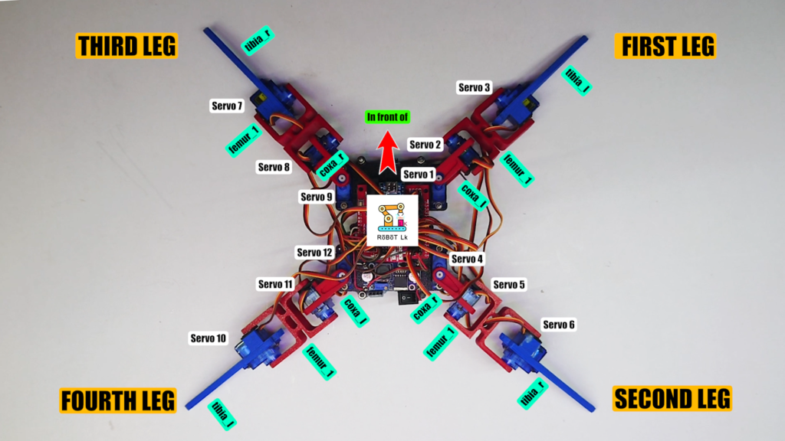
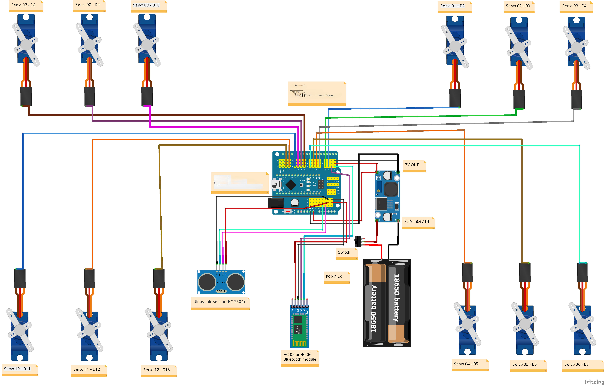

# 🔥 Autonomous Fire and Smoke Detection Spider Robot (Quadruped)

[](https://opensource.org/licenses/MIT)
[](https://www.arduino.cc/)
[](https://en.wikipedia.org/wiki/Quadruped)

The **Autonomous Fire and Smoke Detection Spider Robot** is a 4-legged (quadruped) biologically-inspired robot designed for autonomous fire and smoke detection in indoor environments. It combines advanced sensor technology with intelligent locomotion to navigate spaces and detect potential fire hazards before they escalate.




---

## 🧠 Key Features

- **Quadruped Locomotion:** Four-legged spider-like walking robot for stable, versatile movement on varied terrain
- **Smoke Detection:** Real-time smoke and combustible gas detection using MQ-2 sensor module
- **Flame Detection:** Infrared flame detection using IR sensor with LM393 comparator (760nm-1100nm wavelength)
- **Obstacle Avoidance:** Autonomous navigation using HC-SR04 ultrasonic distance sensor
- **Wireless Communication:** Bluetooth connectivity (HC-05/HC-06) for remote monitoring and alerts
- **Autonomous Operation:** Independent patrol and detection without human intervention

---



## ⚙️ Hardware Overview

| Component | Description | Quantity |
|-----------|-------------|----------|
| **Arduino Nano V3.0** | ATmega328P microcontroller, 16MHz, 32KB Flash | 1 |
| **SG90 Servo Motors** | 9g micro servos, 1.8kg-cm torque, 180° rotation | 12 |
| **MQ-2 Gas Sensor** | Smoke/LPG/Alcohol/CO detection, 200-10000ppm | 1 |
| **IR Flame Sensor** | 760-1100nm detection, 60° angle, up to 80cm range | 1 |
| **HC-SR04 Ultrasonic** | 2-400cm range, ±3mm accuracy | 1 |
| **HC-05/HC-06 Bluetooth** | V2.0+EDR, up to 100m range, UART interface | 1 |
| **LM2596 Buck Converter** | 4.5-40V input, 1.25-35V output, 3A max | 1 |
| **18650 Li-ion Batteries** | 3.7V nominal, 2500mAh, 2S configuration | 2 |

---

## 📊 Technical Specifications

### Power System
- **Battery Configuration:** 2S (2 cells in series)
- **Nominal Voltage:** 7.4V
- **Regulated Output:** 5V-6V via LM2596
- **Estimated Runtime:** ~2.5 hours continuous operation

### Sensor Specifications
| Sensor | Detection Range | Accuracy | Response Time |
|--------|----------------|----------|---------------|
| MQ-2 Smoke | 200-10,000 ppm | Variable | ~20s warm-up |
| IR Flame | Up to 80cm | 60° angle | Instant |
| HC-SR04 | 2-400cm | ±3mm | ~10ms |

### Communication
- **Protocol:** Bluetooth V2.0+EDR
- **Baud Rate:** 9600 bps (default)
- **Range:** <100m (open space)

---

## 🔌 Pin Configuration

```
Arduino Nano Pin Mapping:
├── D0 (RX)  → HC-05 TXD (Bluetooth receive)
├── D1 (TX)  → HC-05 RXD (Bluetooth transmit)
├── D2       → IR Flame DO (Digital flame detection)
├── D3 (PWM) → Servo 1 (Leg 1 Hip)
├── D4       → MQ-2 DO (Digital smoke detection)
├── D5 (PWM) → Servo 2 (Leg 1 Knee)
├── D6 (PWM) → Servo 3 (Leg 2 Hip)
├── D7       → HC-SR04 TRIG
├── D8       → HC-SR04 ECHO
├── D9-D11   → Servos 4-6 (Additional legs)
├── A0       → MQ-2 AO (Analog smoke level)
├── A1       → IR Flame AO (Analog flame intensity)
├── VIN      → LM2596 OUT+ (5V regulated)
└── GND      → Common Ground
```

---

## 🚀 Getting Started

### Prerequisites
- Arduino IDE 2.x or later
- Required Libraries:
  - `Servo.h` (built-in)
  - `SoftwareSerial.h` (built-in)

### Installation

1. **Clone the repository**
   ```bash
   git clone https://github.com/yourusername/fire-smoke-detection-spider-robot.git
   cd fire-smoke-detection-spider-robot
   ```

2. **Hardware Assembly**
   - Assemble the quadruped spider frame
   - Mount 12 SG90 servos (3 per leg for 4 legs)
   - Connect sensors as per pin configuration
   - Set LM2596 output to 5V-6V using multimeter
   - Install charged 18650 batteries

3. **Upload Code**
   - Open `main.ino` in Arduino IDE
   - Select Board: "Arduino Nano"
   - Select Processor: "ATmega328P"
   - Upload to Arduino Nano

4. **Bluetooth Setup**
   - Pair with device name "HC-05" or "HC-06"
   - Default PIN: `1234` or `0000`
   - Use any Bluetooth terminal app for monitoring

---

## 📁 Project Structure

```
fire-smoke-detection-spider-robot/
├── src/
│   ├── main.ino              # Main Arduino sketch
│   ├── servo_control.h       # Servo motor functions
│   ├── gait_generator.h      # Spider walking patterns
│   ├── sensor_reader.h       # Sensor polling functions
│   └── bluetooth_comm.h      # Wireless communication
├── docs/
│   ├── schematic.pdf         # Circuit diagram
│   ├── bom.xlsx              # Bill of Materials
│   └── assembly_guide.pdf    # Step-by-step assembly
├── 3d_models/
│   ├── body_frame.stl        # Main chassis
│   └── leg_segments.stl      # Leg components
├── images/
│   └── robot_photo.jpg       # Project images
├── README.md
└── LICENSE
```

---

## 🔧 Circuit Diagram

```
                    ┌─────────────────┐
    ┌───────────────┤  18650 Battery  ├───────────────┐
    │               │  Pack (7.4V)    │               │
    │               └────────┬────────┘               │
    │                        │                        │
    │               ┌────────▼────────┐               │
    │               │  LM2596 Buck    │               │
    │               │  Converter      │               │
    │               │  (5V-6V Out)    │               │
    │               └────────┬────────┘               │
    │                        │                        │
    │    ┌───────────────────┼───────────────────┐    │
    │    │                   │                   │    │
    │    ▼                   ▼                   ▼    │
┌───┴────┴───┐     ┌────────────────┐     ┌──────────┴───┐
│   Servo    │     │  Arduino Nano  │     │   Sensors    │
│   Shield   │◄────┤  (ATmega328P)  ├────►│  MQ-2, IR,   │
│  12x SG90  │     │                │     │  HC-SR04,    │
│ (4 Legs)   │     │                │     │  HC-05       │
└────────────┘     └────────────────┘     └──────────────┘
```

---

## 📈 Algorithm Flowchart

```
┌─────────────────────────────┐
│         START               │
└──────────────┬──────────────┘
               ▼
┌─────────────────────────────┐
│  Initialize Sensors/Servos  │
└──────────────┬──────────────┘
               ▼
┌─────────────────────────────┐
│   Read MQ-2 Smoke Sensor    │◄──────────────────────┐
└──────────────┬──────────────┘                       │
               ▼                                      │
┌─────────────────────────────┐                       │
│   Read IR Flame Sensor      │                       │
└──────────────┬──────────────┘                       │
               ▼                                      │
        ┌──────┴──────┐                               │
        │ Fire/Smoke  │                               │
        │ Detected?   │                               │
        └──────┬──────┘                               │
         Yes   │   No                                 │
    ┌──────────┴──────────┐                           │
    ▼                     ▼                           │
┌───────────┐     ┌───────────────┐                   │
│  ALERT!   │     │ Read Ultrasonic│                  │
│ Bluetooth │     │    Distance    │                  │
│   Notify  │     └───────┬───────┘                   │
└───────────┘             ▼                           │
                   ┌──────┴──────┐                    │
                   │  Obstacle   │                    │
                   │  < 20cm?    │                    │
                   └──────┬──────┘                    │
                    Yes   │   No                      │
               ┌──────────┴──────────┐                │
               ▼                     ▼                │
        ┌───────────┐         ┌───────────┐          │
        │  Avoid    │         │  Walk     │          │
        │ Obstacle  │         │ Forward   │          │
        └─────┬─────┘         └─────┬─────┘          │
              └──────────┬──────────┘                 │
                         └────────────────────────────┘
```

---

## 👥 Team Members

| Name | Matric No. | Role |
|------|------------|------|
| **Izuafa Abdulrafiu Braimah** | VUG/SEN/22/7708 | Project Lead & Main Documentation |
| **Ibrahim Rahmat Abubakar** | VUG/SEN/22/8245 | Assembly Procedures Research |
| **Ugochukwu Adaugo Queeneth** | VUG/SEN/23/10415 | Software Development |
| **Ikenna Iheanaetu** | VUG/SEN/22/7884 | 3D Design & Visual Documentation |
| **Jepthah Donatus Umaru** | VUG/SEN/22/8244 | Circuit Design & Testing |
| **Obona Jesam Hope** | VUG/SEN/22/7005 | Technical Specifications Research |
| **Oke Emmanuel Olamide** | VUG/SEN/22/7035 | Bill of Materials & Costing |

---

## 📚 Documentation

- [Full Technical Documentation (DOCX)](docs/Fire_Smoke_Detection_Robot_Documentation.docx)
- [Component Datasheets](docs/datasheets/)
- [Assembly Guide](docs/assembly_guide.pdf)
- [video recordings](https://drive.google.com/drive/folders/1TvWOnREhgn4_o92Sp0vzanNgbGl2gPJ4)

---

## 🔗 References

1. Arduino. (2024). *Arduino Nano Documentation*. https://docs.arduino.cc/hardware/nano
2. Texas Instruments. (2024). *LM2596 SIMPLE SWITCHER Power Converter Datasheet*.
3. Elecfreaks. (2024). *HC-SR04 Ultrasonic Ranging Module Datasheet*.
4. Handsontec. (2024). *MQ-2 Gas Sensor Module Documentation*.
5. TowerPro. (2024). *SG90 Micro Servo Specifications*.
6. ITead Studio. (2024). *HC-05 Bluetooth Module Datasheet*.

---

## 📄 License

This project is licensed under the MIT License - see the [LICENSE](LICENSE) file for details.

---

## 🙏 Acknowledgments

- Veritas University Abuja - Department of Software Engineering
- SEN 481 Course Instructors
- Open-source Arduino community

---

<p align="center">
  <b>© 2026 Veritas University Abuja – SEN 481 Software Engineering Robotics Project</b>
</p>
